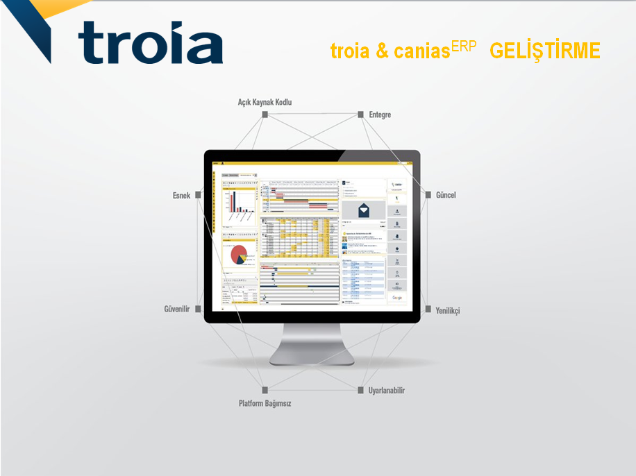

# CANIASERP
Canias Erp pdf Sources

* **Hazırlayan**      : Leyla Akmancı | [leyla.manci@gmail.com](mailto:leyla.manci@gmail.com)
* **Katkı Sunanlar**  : ---
* **Version**  : 603,604,802

***

# Getting Started

### Basic Syntax

* Functions
* Variables
* Comments
* String templates
* Conditional expressions
* Type checks and automatic casts
* for loop
* while loop
* Virtual Tables
* Loop At virtual-tables
* Collections
* Creating basic classes and their instances

### Idioms

* Default values for function parameters
* Filtering a list
* Checking element presence in a collection
* String Interpolation
* Instance Checks
* Get first item of a possibly empty collection
* 'if' expression
* Configuring properties of an object (apply)

***

# Basics

### Basic Types

* Numbers
* Literal constants
* Underscores in numeric literals (since 1.1)
* Representation
* Explicit conversions
* Operations
* Floating point numbers comparison
* Characters
* Booleans
* Arrays
* Primitive type arrays
* Unsigned integers
* Specialized classes
* Literals
* Experimental status of unsigned integers
* Strings
* String literals
* String templates

### Control Flow

* If Expression
* When Expression
* For Loops
* While Loops
* Break and continue in loops

***

# Classes & Objects

### Classes and Inheritance

* Classes
* Constructors
* Secondary constructors
* Creating instances of classes
* Class members
* Inheritance
* Overriding methods
* Calling the superclass implementation

### Visibility Modifiers

* Visibility Modifiers
* Local declarations

***

# Functions & Lambdas

### Functions

* Function declarations
* Function usage
* Parameters
* Unit-returning functions
* Explicit return types
* Function scope
* Local functions
* Member functions

***

# Collections

### Collections Overview

* Collection types
* Collection
* List
* Tables
* Map

### Constructing Collections

* Empty collections
* Copying
* Invoking functions on other collections

### Iterators

* Iterators
* List iterators

### Collection Write Operations

* Adding elements
* Removing elements
* Updating elements

### List Specific Operations

* List Specific Operations
* Retrieving elements by index
* Retrieving list parts
* Finding element positions
* Linear search
* Binary search in sorted lists
* Comparator binary search
* Comparison binary search
* List write operations
* Adding
* Updating
* Removing
* Sorting

### Map Specific Operations

* Map Specific Operations
* Retrieving keys and values
* Filtering
* plus and minus operators
* Map write operations
* Adding and updating entries
* Removing entries

***

# Others

### Type Checks and Casts

* Smart Casts
* "Unsafe" cast operator

### This expressions

* This Expression
* Qualified this

### Equality 🌈

* Equality
* Structural equality
* Floating point numbers equality
* Referential equality

### Scope Functions

* Scope Functions
* Return value
* run

***

Code with ❤️

